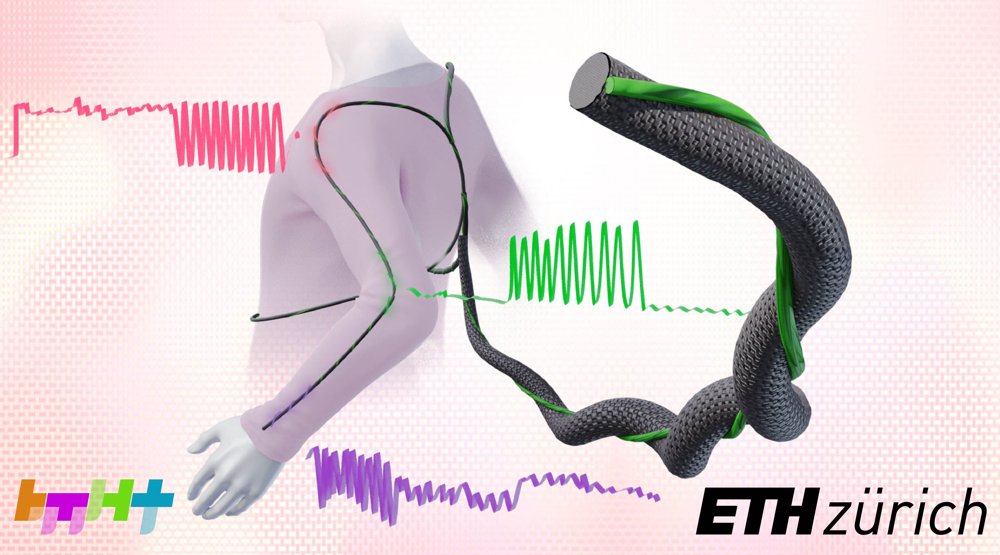
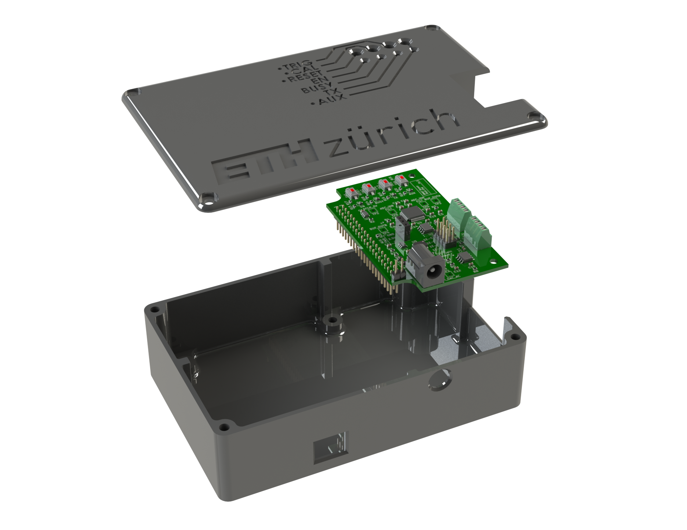

# Sensor Readout Board

This repository includes the software, firmware, and hardware for the readout electronics used in the paper:

> B. C. Hannigan, T. J. Cuthbert, C. Admadizadeh, and C. Menon, _Distributed Sensing Along Fibres for Smart Clothing_. April 2023. [Preprint]

## Python Client

The `Client` subfolder contains the source code for the PC client, written in Python. The client allows connection to the FPGA and optional logging of data. The data can be interpreted in a variety of formats, such as:
- `raw`: raw ADC counts (32-bit signed integer)
- `iq`: impedances expressed as in-phase and quadrature components (equivalently, real and imagingary impedance components) in Ohms.
- `magphase`: impedances expressed as magnitude (in dB) and phase (in degrees).
- `RCseries`: impedances converted to resistance and capacitance values in an RC series circuit.
- `RCparallel`: impedances converted to resistance and capacitance values in an RC parallel circuit.
- `model`: (experimental) processed signals using a provided model (e.g., from sklearn or Keras) to convert the raw signals into a measure of interest.
Command-line arguments exist to control the COM port and logfile destination. One can also enable or disable the plotting of data to the screen and triggering ability. Note that the correct gain that matches the jumper on the PCB must be supplied via command-line argument for the scaling to be correct. There also exist some calibration curves as Excel spreadsheets.

## FPGA Firmware

The `Firmware` folder contains many general-purpose logic buliding blocks such as counters, FIFOs, memories, etc. and associated test-benches. The `Firmware/top` subfolder contains the top-level Verilog file `top.v` which was used for the data collection in the paper. This relies directly on the following third-party libraries:
- `verilog-lfsr` by Alex Forencich: https://github.com/alexforencich/verilog-lfsr. Used to implement the linear-feedback shift register that enables redundancy checking for the MIN protocol serial packets.
- `osdvu/uart` by Timothy Goddard: https://github.com/cyrozap/osdvu. Used to implement the UART.
- `min-protocol` by Ken Tindell: https://github.com/min-protocol/min. Used to frame the data sent to the PC.

## Hardware

The `Hardware/Enclosure` subfolder contains Solidworks files for the system enclosure. These were printed on a FDM 3D printer. The `Hardware\PCB` subfolder contains PCB schematic and layout files from KiCAD. The other subfolders contain (disorganized) SPICE simulations, previous iterations, and other files used during development.

©2023 ETH Zurich, Brett Hannigan; D-HEST; Biomedical and Mobile Health Technology (BMHT) Lab; Carlo Menon